**"Artists need funds"** – that's the simple philosophy behind **Kord**. Independent musicians constantly struggle to finance albums, tours, and creative projects. Traditional labels take 80%+ cuts, streaming pays pennies, grants are scarce. 

**Kord** flips this: **Fans directly fund tokenized artist projects** on **Solana + Audius**. Artists get patient capital via **milestone crowdfunding**. Fans get **AUDIO royalties + real ownership** through liquidity pools. 

**The Story**: Tokenize upcoming projects → Validate realistic budgets → Crowdfund from fans/traders → Artists deliver (milestones prevent rugs) → **Post-release royalties automatically grow token value**. 

**Result**: Artists create freely. Fans profit from success. **Kickstarter × Raydium × Audius**.

***

## 🎵 Core Components {#components}

```
Artist Proposal → Tokenized Crowdfund → Milestone Releases → 
Audius Anchor → Raydium LP Appreciation → Fan ROI (AUDIO)
```

### 1. Fixed Tokenomics Template {#tokenomics}

| Component | Allocation | Purpose |
|-----------|------------|---------|
| **Public Sale** | 50% (500k tokens) | **Fan investments** |
| **Initial LP** | 20% (200k tokens) | Raydium trading liquidity |
| **Anchor Royalties** | 20% (200k tokens) | **AUDIO streaming revenue** |
| **Artist/Team** | 10% (100k tokens) | Vested creative incentives |

**Total Supply**: **1,000,000 SPL tokens/project** (fixed forever).

### 2. Audius Anchor Organization {#anchor}
**Legal entity** (LLC/DAO) owns licenses, collects:
- **Audius AUDIO rewards** from streams
- Digital sales, tour profits, merch

**Revenue Flow**:

```mermaid
graph LR
    A[Audius Streams] --> B[AUDIO Tokens]
    B --> C[Anchor Wallet]
    C --> D[Raydium LP Deposit]
    D --> E[Project Token Price ↑]
```


***
