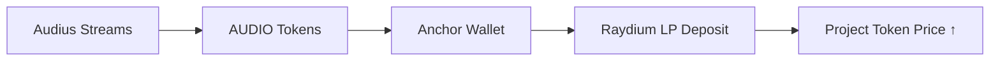

# Overview

**"Artists need funds"**—this simple truth drives everything about **Kord**. Independent musicians face a brutal funding reality: record labels demand 80-90% of revenue, streaming platforms pay $0.003-0.005 per stream (needing millions of plays just to break even), grants are lottery tickets, and personal loans suffocate creativity with debt.

**Kord solves this fundamentally**: Fans become **direct investors** in tokenized artist projects (albums, tours, videos) built on **Solana** and powered by **Audius**. Artists get upfront capital through **transparent milestone crowdfunding**. Fans get **real ownership** through project tokens that appreciate via **streaming royalties deposited into liquidity pools**.

### The Problem Kord Solves <a href="#problem" id="problem"></a>

**Artists are stuck**:

```
$50K album budget breakdown:
- Studio time: $20K (40%)
- Producer/mixing: $12K (24%)
- Artwork/video: $8K (16%)
- Marketing/promotion: $7K (14%)
- Distribution/mastering: $3K (6%)
```

**Traditional paths fail**:

* **Labels**: Take 80%+ forever, own masters
* **Streaming**: 1M Spotify streams = \~$4K (pays rent, not albums)
* **Crowdfunding**: Kickstarter gives funds once, no revenue share
* **NFTs**: Speculative drops, 95% lose value post-mint

**Kord Path**:

```markdown
Artist needs $50K → Fans buy 500K tokens @ $0.10 → 
Artist gets 90% ($45K) via milestones → 10% seeds LP
Album releases → Audius streams generate 10K AUDIO/mo → 
Anchor deposits LP → Token hits $0.50 → Fans 5x
```

#### Why This Actually Works <a href="#why-it-works" id="why-it-works"></a>

**1. Artists Win Big**:

```
Traditional: $50K label advance → Repay $400K over career
Kord: $50K patient capital → Keep 100% future royalties
+ Passive LP growth from their own streams
```

**2. Fans Get Real Ownership** (not NFTs):

```
NFTs: "Own this JPEG" → Worth $0 in 6 months
Kord: "Own this album's revenue stream" → 
AUDIO royalties → LP value → Tradeable asset
```

**3. Tokenomics Impossible to Ruin**:

```
Fixed 1M supply → No inflation
LP auto-fed → Guaranteed buy pressure
Anchor multisig → Trusted revenue flow
```

**4. Audius Perfect Integration**:

```
500K+ artists/fans already onboarded
AUDIO token rewards = perfect royalty proxy
Streaming data = verifiable success metric
```

#### The Flywheel Effect <a href="#flywheel" id="flywheel"></a>

```
1. Successful projects → Token price ↑
2. Happy artists → More projects  
3. Fans see ROI → Bigger investments
4. Platform fees → Better UX/marketing
5. → Repeat
```

#### Economic Reality Check <a href="#economics" id="economics"></a>

**Real numbers from indie music**:

```
Average indie album: 1M streams Year 1 → 5K AUDIO ($15K)
Tour 10 cities: $25K net profit
Merch: $10K
Total Year 1 revenue: $50K → 100% LP growth
```

**Artist still nets $35K cash upfront** + future royalties + token vesting.

**Kord** = **"Artists need funds. Fans want ownership. We tokenized the bridge."**

**One protocol. Two winners. Infinite albums.** 🎵⚡

***

### 🎵 Core Components <a href="#components" id="components"></a>

```
Artist Proposal → Tokenized Crowdfund → Milestone Releases → 
Audius Anchor → Raydium LP Appreciation → Fan ROI (AUDIO)
```

#### 1. Fixed Tokenomics Template <a href="#tokenomics" id="tokenomics"></a>

| Component            | Allocation        | Purpose                     |
| -------------------- | ----------------- | --------------------------- |
| **Public Sale**      | 50% (500k tokens) | **Fan investments**         |
| **Initial LP**       | 20% (200k tokens) | Raydium trading liquidity   |
| **Anchor Royalties** | 20% (200k tokens) | **AUDIO streaming revenue** |
| **Artist/Team**      | 10% (100k tokens) | Vested creative incentives  |

**Total Supply**: **1,000,000 SPL tokens/project** (fixed forever).

#### 2. Audius Anchor Organization <a href="#anchor" id="anchor"></a>

**Legal entity** (LLC/DAO) owns licenses, collects:

* **Audius AUDIO rewards** from streams
* Digital sales, tour profits, merch

**Revenue Flow**:



***
