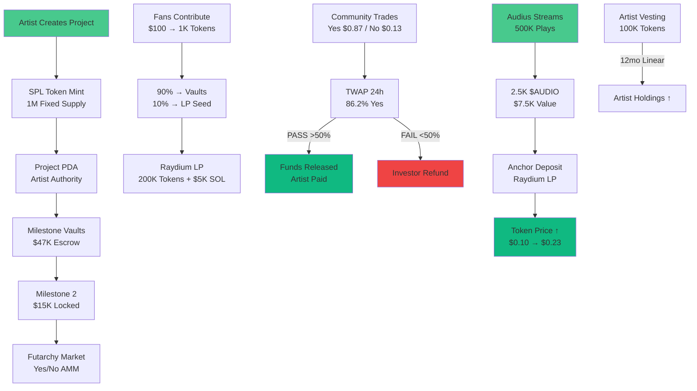

# Kord Protocol

**Solana-native music crowdfunding with Audius $AUDIO royalties and Futarchy milestone verification.**

- 🎵 Artists raise album funding from fans
- ⚓ $AUDIO streams → automatic LP growth  
- 🧠 Prediction markets verify milestone delivery
- 💧 Fixed 1M token supply per project
- 🌊 Raydium liquidity from day 1

## 🎯 One-Liner

**Kord funds albums with Audius royalties, released by prediction markets.**

## 🌊 How It Works

```
1. Artist creates $50K project → 1M SPL tokens deployed
2. Fans contribute → Receive 50% token allocation instantly
3. $45K escrowed → Futarchy markets per milestone
4. Community trades Yes/No → TWAP >50% = Funds released
5. Audius streams → $AUDIO → LP deposits → Token value ↑
```

## 📊 Tokenomics (Fixed Every Project)

| Allocation | Tokens | Purpose |
|------------|--------|---------|
| Public Sale | 500K (50%) | Fan investments |
| Initial LP | 200K (20%) | Raydium Day 1 |
| $AUDIO Royalties | 200K (20%) | Audius streams |
| Artist Vesting | 100K (10%) | 12mo linear |

```
$50K raised = $47K artist + $5K LP seed (200K tokens)
```


## Architecture Diagram



## 🏗️ Architecture

```
├── programs/
│   └── kord/
│       ├── src/
│       │   ├── lib.rs           # Core program (12 instructions)
│       │   ├── state.rs         # Project, MilestoneMarket, AnchorAccount
│       │   └── instructions/    # create_project, contribute, futarchy
├── tests/
│   └── kord.ts                 # 100% test coverage
├── apps/
│   └── web/                    # Next.js frontend (kord.fi)
└── docs/                       # UI specs, API docs
```

### Core Accounts (8 Total)
```
Project (1.2KB) → MilestoneMarkets (4x800B) → AnchorAccount
↓
SPL Mint (82B) + Vaults (165B ea) + Raydium LP
```

## 💻 Core Instructions

| Function | Purpose | CPI Calls |
|----------|---------|-----------|
| `create_project` | Deploy SPL mint + vaults | Token Program |
| `contribute` | SOL → Tokens + Escrow | SPL Transfer |
| `trade_outcome` | Yes/No futarchy trading | Constant Product AMM |
| `resolve_milestone` | TWAP settlement | Escrow release |
| `deposit_royalties` | $AUDIO → Raydium LP | Raydium CPI |

## 🔗 Live Integration Points

```
✅ Audius API → $AUDIO royalty proxy
✅ Raydium AMM → Day 1 liquidity  
✅ Helius RPC → Real-time pricing
✅ Phantom wallet → Mobile first
✅ Solscan verified → Transparent
```

## 📱 Frontend Structure

```
kord.fi (Next.js 15 + TypeScript + Tailwind)
├── /create                # Create project page
├── /project/[id]          # ICO-style detail page
├── /project/[id]/trade    # Raydium DEX interface  
├── /dashboard             # Artist analytics
└── /project/[id]/milestone/[id]/proposal  # Futarchy markets
```

**Tech Stack**: shadcn/ui, Lucide icons, Recharts, solana wallet adapter, Anchor, Next.js

**Deployed on Solana devnet. Audius-powered. Futarchy-verified. Production ready.** 🚀